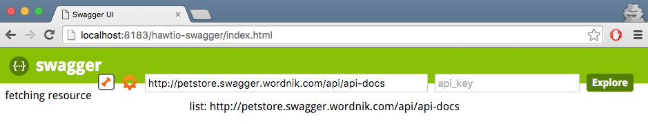
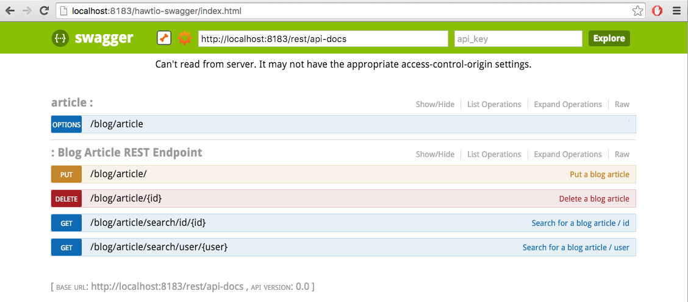
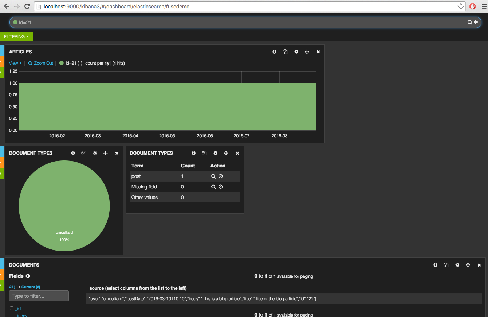

:sectanchors:
:toc: macro
:toclevels: 2
:toc-title: Table of Content
:numbered:
:httpie: link:https://github.com/jkbrzt/httpie[httpie]
:curl: link:http://curl.haxx.se/download.html[curl]
:endpointURL: http://localhost:8183/camel-rest

= REST DSL in Action

toc::[]

== Goals

* Using the new `Rest` DSL and `Elasticsearch` component of Apache Camel, expose CRUD services for a repository of blog articles.
* Secure RESTful endpoints using `APIMan` and `Keycloak` according to different scenario : basic authentication, Oauth2 and Oauth2 & roles.
* Populate and query an Elasticsearch database using the `Elasticsearch` component of Apache Camel.
* Analyze the Elasticsearch data using `Kibana`.
* Document the RESTful endpoints using Swagger API.

== Overview

This JBoss Fuse demo will demonstrate how the new Apache Camel REST DSL syntax can be used to expose REST services.
These REST services will use to add, search or delete blog articles in an Elasticsearch database.
The use case has been enriched to also expose a file endpoint:

image::images/fuse-lab1.png[]

The file endpoint is responsible for polling a folder, consuming csv files in that folder and inserting all the articles into the database.
The Apache Camel Elasticsearch component is called from different routes and will communicate with the ElasticSearch Database to perform the CRUD operations.
The data can be visualized using a Kibana dashboard.
Swagger API will be used to document the RESTFull services.

The Elasticsearch database and the Apache Camel projects will be deployed into different Fuse Managed Containers operated by a JBoss Fuse Fabric Server.

A kibana dashboard will be used to analyze the Blog articles published into the database

The CRUD services can be accessed using the new Camel REST component by performing HTTP requests (GET/PUT/DELETE) while the file component will also allow to do a bulk insert of blog articles.

By example, to use the REST Service responsible to insert an article within the Elasticsearch database, a JSON article `{ "user": "cmoulliard" "postDate": "2015-12-12", "body": "Integration is hard.", "title": "On distributed search" }` message is issued against the REST endpoint `/blog/article/id` using a HTTP GET operation.
The content of this HTTP request will be processed by an Apache Camel route as showed hereafter and transformed in order to access the elasticsearch component to call the Elasticsearch database.

[source,java]
----
rest("/blog/").id("rest-blog-service").produces("application/json").consumes("application/json")

        .put("/article/{id}").id("rest-put-article").type(Blog.class)
            .to("direct:add");

JacksonDataFormat jacksondf = new JacksonDataFormat(Blog.class);

from("direct:add").id("add-direct-route")
        .log(LoggingLevel.INFO,"Add new Blog entry service called !")

        .setHeader(ElasticsearchConfiguration.PARAM_INDEX_NAME).simple("{{indexname}}")
        .setHeader(ElasticsearchConfiguration.PARAM_INDEX_TYPE).simple("{{indextype}}")
        .setHeader(ElasticsearchConfiguration.PARAM_OPERATION).constant(ElasticsearchConfiguration.OPERATION_INDEX)

        // Transform Java Object to JSON
        .marshal(jacksondf)

        // Call the add service of the elasticsearchService POJO to generate the IndexRequest object
        .beanRef("elasticSearchService", "add")

        // Call the elasticsearch Service to add/insert an entry within the index
        .to("elasticsearch://{{clustername}}?ip={{address}}")

        // Response received and returned to the REST endpoint
        .log("Response received : ${body}");
----

The following table summaries the Routes used, REST Services exposed and the Bean Methods called like the Object type used to call the ElasticSearch database

|====
| Rest URl | Operation | Route | Bean method | ElasticSearch Class Type
| /blog/article/ | PUT | AddArticleToElasticRoute | ElasticSearchService.add() | IndexRequest
| blog/article/search/user/{user} | GET | SearchArticleToElasticRoute | ElasticSearchService.getBlog() | GetResponse
| blog/article/search/id/{id} | GET | SearchArticleToElasticRoute | ElasticSearchService.getBlogs() | SearchResponse
| blog/article/{id} | DELETE | DeleteArticleToElasticRoute | ElasticSearchService.() | DeleteRequest
|====

To do this bulk import, you will create a CSV file containing this record structure `id,user,blog description,title` that you can define several times into the file.
All the records will be uploaded by the file endpoint, transformed using the `Apache Camel Bindy` Dataformat to a collection of Blog objects.
Next, each Blog object will be used as input object to issue a request to insert a new record within the Elasticsearch database using the Bean ElasticSearch.

[source,java]
----
from("{{fileUri}}")
    .log(LoggingLevel.DEBUG,"Records received : ${body}")
    .unmarshal(csv)
    .split(body())
        .setHeader("id").simple("${body.id}")
        .to("direct:add");

JacksonDataFormat jacksondf = new JacksonDataFormat(Blog.class);

from("direct:add").id("add-direct-route")
    .log(LoggingLevel.INFO,"Add new Blog entry service called !")

    .setHeader(ElasticsearchConfiguration.PARAM_INDEX_NAME).simple("{{indexname}}")
    .setHeader(ElasticsearchConfiguration.PARAM_INDEX_TYPE).simple("{{indextype}}")
    .setHeader(ElasticsearchConfiguration.PARAM_OPERATION).constant(ElasticsearchConfiguration.OPERATION_INDEX)

    // Transform Java Object to JSON
    .marshal(jacksondf)

    // Call the add service of the elasticsearchService POJO to generate the IndexRequest object
    .beanRef("elasticSearchService", "add")

    // Call the elasticsearch Service to add/insert an entry within the index
    .to("elasticsearch://{{clustername}}?ip={{address}}")
    .log("Response received : ${body}");
----

== Prerequisites

- https://www.jboss.org/download-manager/file/jboss-fuse-6.2.1.GA-full_zip.zip[JBoss Fuse 6.2.1.GA]
- http://www.jboss.org/download-manager/file/jboss-devstudio-8.1.0.GA-standalone_jar.jar[JBoss Developer Studio]
- {httpie} or {curl}
- JDK 1.7 or 1.8
- Apache Maven 3.2.3

== Installation

The following is an overview of the installation steps involved with this project :

* https://github.com/FuseByExample/rest-dsl-in-action/archive/jboss-fuse-6.2.1.zip[Download] and compile the project locally
* Edit the hosts file to add an entry
* Download and install the JBoss Fuse Server
* Edit the etc/users.properties file of the server to define an admin user
* Create a Fuse Fabric Server and 2 child containers
* Deploy the Fabric project into the Fabric Server
* Run a Web Container to provide access to the Kibana dashboard
* Play with the demo

=== Compile Project

. Open a Windows or Unix terminal.
. Using the `git` utility, clone this project to your local workstation.
+
NOTE: For the purposes of these lab instructions, the directory of this cloned project on your local workstation will be referred to as: `$DEMO_DIRECTORY`.
. Change directory into: `$DEMO_DIRECTORY` and build the maven project:
+
----
cd rest-dsl-in-action
mvn clean install
----

=== Networking

Ensure that your $HOSTNAME environment variable on your workstation maps to either:

.. Your local loopback address (127.0.01) when NOT connected to a network OR
.. The ip address of the network your workstation is currently connected to (wifi, ethernet, etc).

On Unix type operating systems, these networking modifications can be made in: `/etc/hosts`.

The workstation's `hostname` is used by the following components:

. The ElasticSearch server uses the `hostname` to bind its socket server upon start up.
. The Apache Camel Elasticsearch component uses the `hostname` to access the Elasticsearch server.
. The Fuse Fabric Server uses the `hostname` to assign an IP address to the socket server of the Apache Zookeeper server.

=== Install and Run JBoss Fuse

. Download JBoss Fuse Server and unzip the archive file.
+
NOTE: For the purposes of this lab, the directory created from having unzipped the `JBoss Fuse` zip archive will be referred to as `$FUSE_HOME`.
. Edit the `etc/user.properties` file found in the home directory of `jboss-fuse-6.2.1.redhat-xxx`
+
Uncomment the line containing the `admin` user and save the file.
+
-----
admin=admin,admin,manager,viewer,Monitor, Operator, Maintainer, Deployer, Auditor, Administrator, SuperUser
-----
. Open a second Windows or Unix terminal and change directory to the root of the JBoss Fuse installation.
. Execute the following command to make all Fuse shell scripts executable:
+
-----
chmod 755 bin/*
-----
. Execute the following command to launch the JBoss Fuse Server:
+
-----
./bin/fuse
-----

=== Create a Fuse Fabric Server with 2 child containers

. Next, within the Fuse Karaf console, issue the following shell command:
+
-----
shell:source mvn:org.jboss.fuse/deployment/1.0/script/install
-----
+
[NOTE]
====
The `install` shell script contains some Fabric subshell commands responsible for setup of a Fabric server and two containers (elasticsearch-node and demo).
The first child container will be used as the Elasticsearch database server.
The second Fuse managed container is used to run the Apache Camel Routes and expose the REST and File endpoints.
====
+
----
$JBOSS_FUSE_INSTALL/bin/fuse

Please wait while JBoss Fuse is loading...
100% [========================================================================]

      _ ____                  ______
     | |  _ \                |  ____|
     | | |_) | ___  ___ ___  | |__ _   _ ___  ___
 _   | |  _ < / _ \/ __/ __| |  __| | | / __|/ _ \
| |__| | |_) | (_) \__ \__ \ | |  | |_| \__ \  __/
 \____/|____/ \___/|___/___/ |_|   \__,_|___/\___|

  JBoss Fuse (6.2.1.redhat-084)
  http://www.redhat.com/products/jbossenterprisemiddleware/fuse/

Hit '<tab>' for a list of available commands
and '[cmd] --help' for help on a specific command.

Open a browser to http://localhost:8181 to access the management console

Create a new Fabric via 'fabric:create'
or join an existing Fabric via 'fabric:join [someUrls]'

Hit '<ctrl-d>' or 'osgi:shutdown' to shutdown JBoss Fuse.

JBossFuse:karaf@root>shell:source mvn:org.jboss.fuse/deployment/1.0/script/install
...
----
+
After a few moments, the server will report on the console that the Fabric Server and the 2 child containers have been created.
+
----
Waiting for container: root
Waiting for container root to provision.

Creating new instance on SSH port 8102 and RMI ports 1100/44445 at: /Users/chmoulli/Fuse/Fuse-servers/jboss-fuse-6.2.0.redhat-133/instances/elasticsearch-node
The following containers have been created successfully:
	Container: elasticsearch-node.
Creating new instance on SSH port 8103 and RMI ports 1101/44446 at: /Users/chmoulli/Fuse/Fuse-servers/jboss-fuse-6.2.0.redhat-133/instances/lab
The following containers have been created successfully:
	Container: demo.
----
+
. Verify that the 2 containers are running by issuing the command:  `fabric:container-list`.
+
Inspect the column `connected` which represents the state of the Fuse OSGI containers.
If the status is equal to `yes`, then the container has been created successfully.
The `provision status` column reports the status of the provisioning of the container.
If the status is equal to `success`, that means that the server has been packaged with the required OSGI bundles, Config Properties files, ...
+
----
JBossFuse:karaf@root>fabric:container-list
[id]                 [version]  [type]  [connected]  [profiles]                       [provision status]
root*                 1.0        karaf   yes          fabric                           success
                                                      fabric-ensemble-0000-1
                                                      jboss-fuse-full
  elasticsearch-node  1.0        karaf   yes          insight-elasticsearch.datastore  success
  demo                1.0        karaf   yes          feature-camel                    success
----

=== Deploy the Fabric project into the Fabric Server

. In a terminal window, change to the `routing` directory of this project: `rest-dsl-in-action/routing`
. Execute the following command:
+
----
mvn fabric8:deploy
----
+
Doing so will deploy the `demo` project configuration into the `gpe-fuse` profile of the Fabric Server.

.. If Fuse has not been previously run on your workstation, it's likely that the following prompt will appear:
+
-----
There is no <server> section in your ~/.m2/settings.xml file for the server id: fabric8.upload.repo

You can enter the username/password now and have the settings.xml updated or you can do this by hand if you prefer.

Would you like to update the settings.xml file now? (y/n): y
Please let us know the login details for this server: fabric8.upload.repo

Username: admin
Password:
Repeat Password:

Copied original: /home/$USER/.m2/settings.xml to: /home/$USER/.m2/settings.xml.backup-1.xml
Updated settings file: /home/$USER/.m2/settings.xml
-----
+
If prompted as per above, respond with a `y` (to allow for a modification to your `~/.m2/settings.xml`) and use username / password credentials of `admin / admin`  (as per the default in `$FUSE_INSTALL/etc/user.properties`).
.. Once deployment is complete, you should see output similar to the following:
+
----
$ mvn fabric8:deploy

[INFO] Uploading file /Users/chmoulli/.m2/repository/com/redhat/gpe/routing/1.0/routing-1.0.jar
Uploading: http://127.0.0.1:8181/maven/upload/com/redhat/gpe/routing/1.0/routing-1.0.jar
Uploaded: http://127.0.0.1:8181/maven/upload/com/redhat/gpe/routing/1.0/routing-1.0.jar (18 KB at 575.9 KB/sec)
Uploading: http://127.0.0.1:8181/maven/upload/com/redhat/gpe/routing/1.0/routing-1.0.pom
Uploaded: http://127.0.0.1:8181/maven/upload/com/redhat/gpe/routing/1.0/routing-1.0.pom (7 KB at 275.5 KB/sec)
[INFO] Updating profile: gpe-fuse with parent profile(s): [feature-camel] using OSGi resolver
[INFO] About to invoke mbean io.fabric8:type=ProjectDeployer on jolokia URL: http://localhost:8181/jolokia with user: admin
[INFO]
[INFO] Profile page: http://127.0.0.1:8181/hawtio/index.html=/wiki/branch/1.0/view/fabric/profiles/gpe/fuse.profile
[INFO]
[INFO] Uploading file org.jboss.fuse.demo.properties to invoke mbean io.fabric8:type=Fabric on jolokia URL: http://localhost:8181/jolokia with user: admin
[INFO] Uploading file fuse-lab1.png to invoke mbean io.fabric8:type=Fabric on jolokia URL: http://localhost:8181/jolokia with user: admin
[INFO] Uploading file Readme.md to invoke mbean io.fabric8:type=Fabric on jolokia URL: http://localhost:8181/jolokia with user: admin
[INFO] Performing profile refresh on mbean: io.fabric8:type=Fabric version: 1.0 profile: gpe-fuse
[INFO] ------------------------------------------------------------------------
[INFO] BUILD SUCCESS
[INFO] ------------------------------------------------------------------------
----
+
. To verify that the profile has been created and published on JBoss Fuse, use the following command within the JBoss Fuse Karaf Console:
+
----
JBossFuse:karaf@root> fabric:profile-display gpe-fuse
Profile id: gpe-fuse
Version   : 1.0
Attributes:
        abstract: false
        parents: feature-camel
Containers:

Container settings
----------------------------
Features :
        camel-bindy
        camel-jackson
        fabric-hawtio-swagger
        camel-jetty
        camel-http4
        swagger
        camel-elasticsearch
        camel-swagger

Bundles :
        mvn:org.mvel/mvel2/2.2.6.Final
        mvn:org.jboss.fuse/routing/1.0
        mvn:org.apache.servicemix.bundles/org.apache.servicemix.bundles.json/20140107_1

Agent Properties :
          lastRefresh.gpe-fuse = 1457616678028

Configuration details
----------------------------
PID: io.fabric8.web.contextPath
  org.jboss.fuse/routing routing

PID: org.jboss.fuse.demo
  indextype post
  address localhost
  indexname blog
  clustername insight
  port 9200
  fileUri file://articles?noop=true

Other resources
----------------------------
Resource: Readme.md
Resource: fuse-lab1.png

----

. Afterwards, install the `gpe-fuse` profile into the `demo` Fuse Demo Managed container
.. Assign the `gpe-fuse` profile to our `demo` container by executing the following fabric command within the JBoss Fuse Console:
+
-----
fabric:container-add-profile demo gpe-fuse
-----
.. Verify that the container has been successfully provisioned and that the `demo` container contains the `feature-camel` and `gpe-fuse` profiles.
To do so, execute the following in the Fuse Console:
+
-----
fabric:container-list
-----
+
----
JBossFuse:karaf@root> fabric:container-list
[id]                  [version]  [type]  [connected]  [profiles]                       [provision status]
root*                 1.0        karaf   yes          fabric                           success
                                                      fabric-ensemble-0000-1
                                                      jboss-fuse-full
  elasticsearch-node  1.0        karaf   no           insight-elasticsearch.datastore  success
  demo                1.0        karaf   no           feature-camel                    success
                                                      gpe-fuse
----
+
[NOTE]
====
If you change the code of this demo, then you can redeploy by executing a `mvn clean install` followed by the `mvn fabric8:deploy` command.
Next, remove and add again the profile to the Fuse Container using these Fabric commands

----
fabric:container-remove-profile demo gpe-fuse
fabric:container-add-profile demo gpe-fuse
----
====

== Setup Elasticsearch Data Mapping

In order to collect the data using the ElasticSearch No SQL database, an index with a name of `blog` and type `article` needs to be created.

In addition, the properties of the new type `article` need to be defined.
To do so, the following JSON definition will be used:

----
{
  "article": {
    "properties": {
      "user": {
        "type": "string"
      },
      "title": {
        "type": "string"
      },
      "postDate": {
        "type": "date",
        "format": "yyyy-MM-dd'T'HH:mm"
      },
      "body": {
        "type": "string"
      },
      "id": {
        "type": "integer"
      }
    }
  }
}
----

The tasks in this section of the lab will be executed by invoking the RESTful services of the `Elasticsearch` container managed by Fuse Fabric.

. In a terminal window, change directory to `$DEMO_DIRECTORY`.
. Execute the following 3 commands  using the either the `http` or `curl` utilities:
.. `http`:
+
----
http PUT http://localhost:9200/blog
http PUT http://localhost:9200/blog/_mapping/article < data/elasticsearch/mapping.json
http http://localhost:9200/blog/_mapping/article
----
.. or `curl`:
+
----
curl -X PUT http://localhost:9200/blog
curl -X PUT http://localhost:9200/blog/_mapping/article -d @data/elasticsearch/mapping.json
curl http://localhost:9200/blog/_mapping/article
----
+
NOTE: The first command creates the index and the second command defines the properties of the new type `article`.
The third command confirms that the mapping between the `article` type and its properties have been created.

== Kibana dashboard and services

The data inserted into the Elasticsearch Database can be analyzed using the https://www.elastic.co/downloads/kibana[Kibana] dashboard.
The dashboard is designed around modern HTML5 Web technologies and can be run locally with a Web Container.

This demo provides a maven goal that launches Kibana embedded in a `Jetty` HTTP Server.
Kibana can then be accessed from a browser at the following address: `http://localhost:9090/index.html`

=== Start Kibana
. To start Kibana in your local workstation, open a terminal window and change to the `$DEMO_DIRECTORY/kibana` directory.
. Execute the following maven command: `mvn exec:run`
+
----
mvn exec:run
...
[INFO] Compiling 1 source file to /Users/chmoulli/MyProjects/fuse-in-action/camel-restdsl-in-action/kibana/target/classes
[INFO]
[INFO] --- exec-maven-plugin:1.4.0:java (default-cli) @ kibana ---
[jboss.fuse.SimpleServer.main()] SimpleServer                   INFO  [Port : 9090]
[jboss.fuse.SimpleServer.main()] log                            INFO  Logging initialized @2660ms
[jboss.fuse.SimpleServer.main()] SimpleServer                   INFO  [index.html page registered as welcome page]
[jboss.fuse.SimpleServer.main()] SimpleServer                   INFO  [Resource Base point to the resources directory]
[jboss.fuse.SimpleServer.main()] SimpleServer                   INFO  [HTTP Simple Server started at the address : http://localhost:9090]
[jboss.fuse.SimpleServer.main()] Server                         INFO  jetty-9.3.0.M1
[jboss.fuse.SimpleServer.main()] ServerConnector                INFO  Started ServerConnector@2d8c784a{HTTP/1.1,[http/1.1]}{0.0.0.0:9090}
[jboss.fuse.SimpleServer.main()] Server                         INFO  Started @2744ms
----

. Once the server is launched, open your browser and navigate to: `http://localhost:9090/index.html`.
+
NOTE: The first time connecting to the Dashboard, the index HTML page will display general content about the kibana project, how to setup a dashboard and how to import data from an Elasticsearch Database.
+
image::images/dashboard1.png[]

=== Load project dashboard

A Kibana dashboard has been created and is provided in this project.
This dashboard is already configured with `histogram` and `list` panels.

The dashboard included in this project needs to be loaded into the Elasticsearch HTTP server.
This can be done via the `kibana-int` REST service running in JBoss Fuse.

. In a terminal window, change to the `$LAB_ASSETS` directory.
. Execute one of the following commands to post the new dashboard to the Elasticsearch HTTP server:
.. `http` utility:
+
----
http PUT http://localhost:9200/kibana-int/dashboard/fusedemo < data/elasticsearch/dashboard.json
----
.. `curl` utility:
+
----
curl -X PUT http://localhost:9200/kibana-int/dashboard/fusedemo -d @data/elasticsearch/dashboard.json
----

. To view the new dashboard, refresh `Kibana` home page within your browser and select the `load` button from the top menu bar:
+
image::images/dashboard2.png[]
+
. Select the `fuse-demo` dashboard:
+
image::images/dashboard3.png[]
+
Currently, the `fuse-demo` dashboard contains panels without any data as we haven't yet populated the database with records.

=== Add and modify blog data
This section of the lab provides instructions on how to add a new blog and modify data maintained in Elasticsearch and exposed through Kibana.
The commands in this section of the lab invoke RESTful camel services (exposed via port 9191) running in a Fuse container managed by Fabric.

. In an open terminal window, change directory to `$DEMO_DIRECTORY`.
. Add a blog
.. Issue one of the following HTTP requests using either the `http` or `curl` utilities:
+
----
http PUT {endpointURL}/blog/article < data/elasticsearch/entry.json
----
+
----
curl -X PUT {endpointURL}/blog/article -d @data/elasticsearch/entry.json
----
+
NOTE: Before issuing the HTTP GET request, the content of the blog article can be modified by editing the file: `data/elasticserch/entry.json`

. Search the user `cmoulliard`
+
----
http {endpointURL}/blog/article/search/user/cmoulliard
----
+
----
curl {endpointURL}/blog/article/search/user/cmoulliard
----

. Search the user which has been encoded with the id `0`
+
----
http {endpointURL}/blog/article/search/id/0
----
+
----
curl {endpointURL}/blog/article/search/id/0
----

. Delete a user.
+
----
http DELETE {endpointURL}/blog/article/0
----
+
----
curl -X DELETE {endpointURL}/blog/article/0
----

== Bulk import

In order to perform a buk import of articles within the ElasticSearch database, copy/paste the records.csv file from the `$DEMO_DIRECTORY/camel/src/data` directory to the `articles` directory created under the local instance `demo`.

. Create the `FUSE_HOME` ENV variable to point to the home directory of the installation directory of JBoss Fuse

    export FUSE_HOME=/Users/chmoulli/Fuse/Fuse-servers/jboss-fuse-6.2.1.redhat-084

. Create the `DEMO_DIRECTORY` ENV variable to point to the folder containing the demo project

    export DEMO_DIRECTORY=`pwd`

. Copy the file
+
----
cp $DEMO_DIRECTORY/routing/src/data/articles/records.csv $FUSE_HOME/instances/demo/articles/
----
+
[NOTE]
====
The `articles` directory folder is scanned by the Apache Camel rote `FileToAddServiceRoute`
====
+
. In your browser, refresh the `kibana` dashboard to see all of the newly imported data.

.Demo dashboard with articles
image::images/dashboard4.png[]

== Swagger documentation

The Camel REST endpoints included in this project are discovered by the `DefaultCamelSwaggerServlet` which is registered as OSGI HTTP Service by Blueprint when the context is initiated.

[source,xml]
----
    <service interface="javax.servlet.http.HttpServlet">
        <service-properties>
            <entry key="alias" value="/rest/api-docs/*"/>
            <entry key="init-prefix" value="init."/>
            <entry key="init.cors" value="true"/>
            <entry key="init.base.path" value="${swaggerBasePath}"/>
        </service-properties>
        <bean class="org.apache.camel.component.swagger.DefaultCamelSwaggerServlet"/>
    </service>
----

This servlet is responsible to parse the REST DSL syntax of Apache Camel and to generate the json file used by the
http://swagger.io/[Swagger API] to display the information within the Swagger Web Doc page.

To access the Camel Ednpoints documented by the Swagger Api, open your browser at the following address `http://localhost:8183/hawtio-swagger/index.html`

WARN: The port number could change depending how many Fuse containers are running within yiour Fabrtic ensemble. If you have followed the instructions of this demo, then the port number is `8183`

. Change the address of the project to scan and add within the field address of the Camel Swagger Api Doc

   http://localhost:8183/rest/api-docs

. Click on `List Operations` link to display all the operations

. You can now add a user by clicking on the service `Put /blog/article`.
. To select the user data, just click on the Model schema and the field (left part of the service `Add a new Blog Article` will be populated.
. Change the data to be used
+
----
{
  "id": "21",
  "user": "cmoulliard",
  "body": "This is a blog article",
  "title": "Title of the blog article",
  "postDate": "2015-10-03T10:10"
}
----
. Click on `try it out!` button
+
image::images/swagger2.png[]
+
. Search for a user using the service `Blog Search Id operation` and fill the parameter with the id `21`
+
image::images/swagger3.png[]
+
. Review the results using the `Kibana` dashboard and search for the id which is equal to `21`
+

Hip hip hourra, you have finished !!!

== Replay

If, for any reason, you would like to restart the demo from the beginning. Then, perform these steps to clean the JBoss Fuse Server

. Exit from the JBoss Fuse Console using the command `CTRL-D` or `osgi:shutdown` command
. Run this script `./bin/deletefabric8`.
+
NOTE: It will kill the jvm instances and delete the instances and some sub-folders defined under the data folder.
. Stop the jetty web container started using the command `mvn jetty:run`

== Troubleshooting

* When the local Camel REST endpoints don't work, you can query directly the elasticsearch database using these HTTPie requests to check if it works.
+
WARNING : The hostname must be changed depending if you run locally or remotely the JBoss Fuse Server
+
----
http {endpointURL}blog/post/1 pretty==true
http http://localhost:9200/blog/post/_search q=="user:cmoulliard" pretty==true

curl 'http://localhost:9200/blog/post/_search?q=user:cmoulliard&pretty=true'
----

* Delete all articles

    http DELETE http://localhost:9200/blog/post/_query q=="user:*"

* Delete Index

    http DELETE http://localhost:9200/blog

* Create Index

    http PUT http://localhost:9200/blog

* Add mapping

    http PUT http://localhost:9200/blog/_mapping/article < data/elasticsearch/mapping.json

* Check mapping

    http http://localhost:9200/blog/_mapping/article

* Add user

    http PUT http://localhost:9200/blog/article/1 < data/elasticsearch/entry.json

== Minimal installation

You can also run the project locally using `mvn camel:run` at the condition that the Karaf feature `insight-elasticsearch` or the profile `insight-elasticsearch.datastore` has been deployed into JBoss Fuse 6.2.

. Open a Windows or Unix terminal and move to the directory `rest-dsl-in-action-master/routing`
. Launch Apache Camel

    mvn camel:run

. Control that Apache Camel has been started

----
[         Blueprint Extender: 3] BlueprintCamelContext          INFO  Apache Camel 2.15.1.redhat-620133 (CamelContext: camel-1) is starting
[         Blueprint Extender: 3] ManagedManagementStrategy      INFO  JMX is enabled
[         Blueprint Extender: 3] ElasticsearchEndpoint          INFO  Joining ElasticSearch cluster insight
[         Blueprint Extender: 3] ElasticsearchEndpoint          INFO  REMOTE ELASTICSEARCH: localhost
[         Blueprint Extender: 3] plugins                        INFO  [Sack] loaded [], sites []
[         Blueprint Extender: 3] JacksonDataFormat              INFO  Registering module: com.fasterxml.jackson.module.jaxb.JaxbAnnotationModule@5ce285fa
[         Blueprint Extender: 3] JacksonDataFormat              INFO  Registering module: com.fasterxml.jackson.module.jaxb.JaxbAnnotationModule@5272a5f
[         Blueprint Extender: 3] JacksonDataFormat              INFO  Registering module: com.fasterxml.jackson.module.jaxb.JaxbAnnotationModule@3fd6ac8d
[         Blueprint Extender: 3] JacksonDataFormat              INFO  Registering module: com.fasterxml.jackson.module.jaxb.JaxbAnnotationModule@37ec4ba9
[         Blueprint Extender: 3] JacksonDataFormat              INFO  Registering module: com.fasterxml.jackson.module.jaxb.JaxbAnnotationModule@354718b0
[         Blueprint Extender: 3] JacksonDataFormat              INFO  Registering module: com.fasterxml.jackson.module.jaxb.JaxbAnnotationModule@5971c095
[         Blueprint Extender: 3] JacksonDataFormat              INFO  Registering module: com.fasterxml.jackson.module.jaxb.JaxbAnnotationModule@4ace6503
[         Blueprint Extender: 3] JacksonDataFormat              INFO  Registering module: com.fasterxml.jackson.module.jaxb.JaxbAnnotationModule@4683ea40
[         Blueprint Extender: 3] HttpComponent                  INFO  Created ClientConnectionManager org.apache.http.impl.conn.PoolingHttpClientConnectionManager@79d51938
[         Blueprint Extender: 3] BlueprintCamelContext          INFO  AllowUseOriginalMessage is enabled. If access to the original message is not needed, then its recommended to turn this option off as it may improve performance.
[         Blueprint Extender: 3] BlueprintCamelContext          INFO  StreamCaching is not in use. If using streams then its recommended to enable stream caching. See more details at http://camel.apache.org/stream-caching.html
[         Blueprint Extender: 3] JacksonDataFormat              INFO  Registering module: com.fasterxml.jackson.module.jaxb.JaxbAnnotationModule@4576c19b
[         Blueprint Extender: 3] FileEndpoint                   INFO  Endpoint is configured with noop=true so forcing endpoint to be idempotent as well
[         Blueprint Extender: 3] FileEndpoint                   INFO  Using default memory based idempotent repository with cache max size: 1000
[         Blueprint Extender: 3] BlueprintCamelContext          INFO  Route: add-direct-route started and consuming from: Endpoint[direct://add]
[         Blueprint Extender: 3] BlueprintCamelContext          INFO  Route: remove-direct-route started and consuming from: Endpoint[direct://remove]
[         Blueprint Extender: 3] BlueprintCamelContext          INFO  Route: file-marshal-split-service started and consuming from: Endpoint[file://src/data/articles?noop=true]
[         Blueprint Extender: 3] BlueprintCamelContext          INFO  Route: route1 started and consuming from: Endpoint[direct://error]
[         Blueprint Extender: 3] JettyHttpComponent             INFO  Using default Jetty continuation timeout for: Endpoint[http://0.0.0.0:9191/blog/article/search/id/%7Bid%7D?httpMethodRestrict=GET]
[         Blueprint Extender: 3] Server                         INFO  jetty-8.1.17.v20150415
[         Blueprint Extender: 3] AbstractConnector              INFO  Started SelectChannelConnector@0.0.0.0:9191
[         Blueprint Extender: 3] BlueprintCamelContext          INFO  Route: rest-searchbyid started and consuming from: Endpoint[http://0.0.0.0:9191/blog/article/search/id/%7Bid%7D?httpMethodRestrict=GET]
[         Blueprint Extender: 3] BlueprintCamelContext          INFO  Route: rest-searchbyuser started and consuming from: Endpoint[http://0.0.0.0:9191/blog/article/search/user/%7Buser%7D?httpMethodRestrict=GET]
[         Blueprint Extender: 3] BlueprintCamelContext          INFO  Route: rest-put-article started and consuming from: Endpoint[http://0.0.0.0:9191/blog/article/%7Bid%7D?httpMethodRestrict=PUT]
[         Blueprint Extender: 3] BlueprintCamelContext          INFO  Route: rest-deletearticle started and consuming from: Endpoint[http://0.0.0.0:9191/blog/article/%7Bid%7D?httpMethodRestrict=DELETE]
[         Blueprint Extender: 3] BlueprintCamelContext          INFO  Route: searchbyid-direct-route started and consuming from: Endpoint[direct://searchById]
[         Blueprint Extender: 3] BlueprintCamelContext          INFO  Route: searchbyuser-direct-route started and consuming from: Endpoint[direct://searchByUser]
[         Blueprint Extender: 3] BlueprintCamelContext          INFO  Route: searchbyuser2-direct-route started and consuming from: Endpoint[direct://searchByUser2]
[         Blueprint Extender: 3] BlueprintCamelContext          INFO  Total 11 routes, of which 11 is started.
[         Blueprint Extender: 3] BlueprintCamelContext          INFO  Apache Camel 2.15.1.redhat-620133 (CamelContext: camel-1) started in 0.660 seconds
[ #0 - file://src/data/articles] add-direct-route               INFO  Add new Blog entry service called !
[ #0 - file://src/data/articles] add-direct-route               INFO  Response received : 1
[ #0 - file://src/data/articles] add-direct-route               INFO  Add new Blog entry service called !
[ #0 - file://src/data/articles] add-direct-route               INFO  Response received : 2
[ #0 - file://src/data/articles] add-direct-route               INFO  Add new Blog entry service called !
[ #0 - file://src/data/articles] add-direct-route               INFO  Response received : 3
...
----

NOTE : Additional parameters could be defined for the elasticsearch database using the `io.fabric8.elasticsearch-insight.cfg` config file deployed into the `etc` folder of JBoss Fuse.
That should also work if you deploy locally an Elasticsearch instance on your machine but this use case hasn't been tested.

= CRUD requests - all in

When you would like test your project and if the Elasticsearch server is running locally, you can copy/paste this list of HTTPie queries to play with the CRUD scenario
It will delete the blog index, create a new index, insert articles, search using a user name or id and will delete
a user.

----
http DELETE http://localhost:9200/blog
http PUT http://localhost:9200/blog
http PUT http://localhost:9200/blog/_mapping/article < data/elasticsearch/mapping.json
http http://localhost:9200/blog/_mapping/article

http PUT {endpointURL}/blog/article < data/elasticsearch/entry.json

http {endpointURL}/blog/article/search/id/0

http {endpointURL}/blog/article/search/user/cmoulliard
http {endpointURL}/blog/article/search/user/cmoullia

http DELETE {endpointURL}/blog/article/1
http {endpointURL}/blog/article/search/id/1
----
