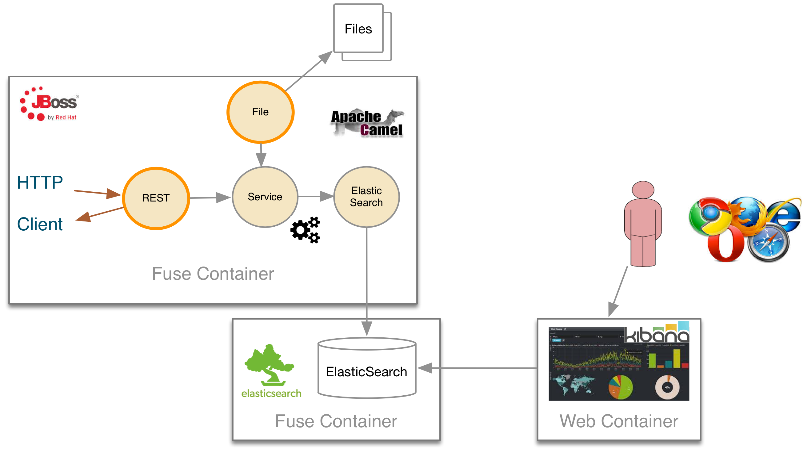
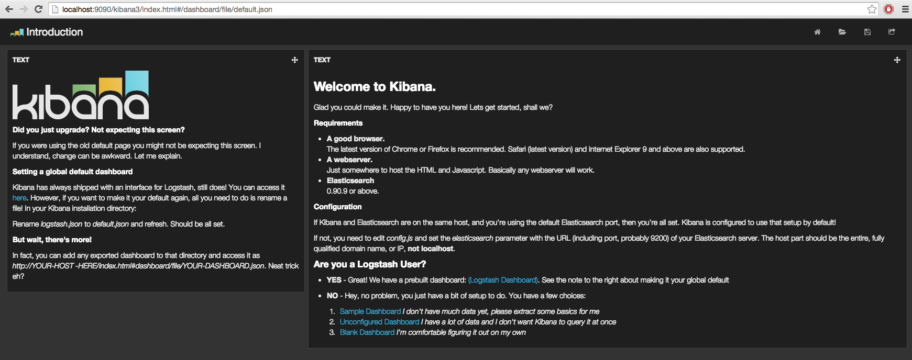
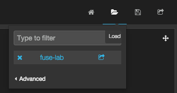
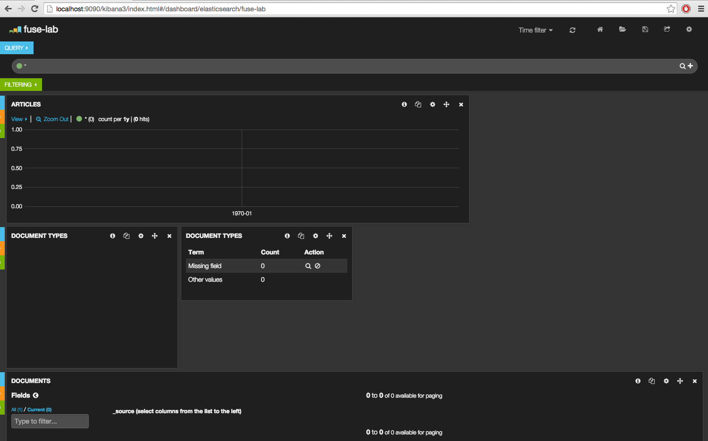
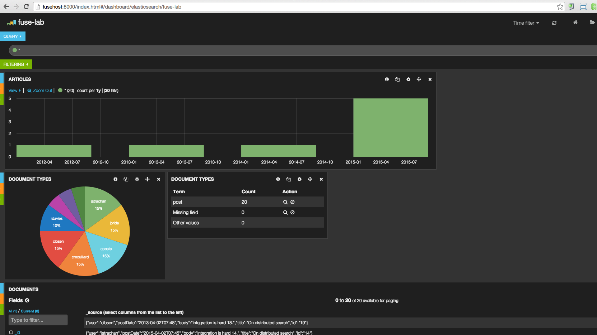

:sectanchors: 

# REST DSL in Action

This JBoss Fuse demo will demonstrate how the new Apache Camel REST DSL syntax can be used to expose REST Services that we will use to add, search or delete
articles for a blog into the Elasticsearch database. The use case has been enriched to expose also a file endpoint, as you can see within the following picture, which
is responsible to poll a folder, to consumes csv files and insert all the articles into the database. The Apache Camel Elasticsearch component is called from different routes
and will communicate with the ElasticSearch Database to perform the CRUD operations.

The Elasticsearch database and the Apache Camel projects will be deployed into different Fuse Managed Containers operated by a JBoss Fuse Fabric Server.

A kibana dashboard will be used to analyze the Blog articles published into the database

The CRUD services can be accessed using the new Camel REST component by performing HTTP requests (GET/PUT/DELETE) while the file component will also allow to do a bulk insert of blog articles.

By example, to use the REST Service responsible to insert an article within the Elasticsearch database, a JSON article `{ "user": "cmoulliard" "postDate": "2015-12-12", "body": "Integration is hard.", "title": "On distributed search" }` message is issued against the REST endpoint `/blog/article/id` using a HTTP GET operation. 
The content of this HTTP request will be processed by an Apache Camel route as showed hereafter and transformed in order to access the elasticsearch component to call the Elasticsearch database. 

[source,java]
----
rest("/blog/").id("rest-blog-service").produces("application/json").consumes("application/json")
        
        .put("/article/{id}").id("rest-put-article").type(Blog.class)
            .to("direct:add");
            
JacksonDataFormat jacksondf = new JacksonDataFormat(Blog.class);

from("direct:add").id("add-direct-route")
        .log(LoggingLevel.INFO,"Add new Blog entry service called !")
        
        .setHeader(ElasticsearchConfiguration.PARAM_INDEX_NAME).simple("{{indexname}}")
        .setHeader(ElasticsearchConfiguration.PARAM_INDEX_TYPE).simple("{{indextype}}")
        .setHeader(ElasticsearchConfiguration.PARAM_OPERATION).constant(ElasticsearchConfiguration.OPERATION_INDEX)

        // Transform Java Object to JSON
        .marshal(jacksondf)
        
        // Call the add service of the elasticsearchService POJO to generate the IndexRequest object
        .beanRef("elasticSearchService", "add")

        // Call the elasticsearch Service to add/insert an entry within the index
        .to("elasticsearch://{{clustername}}?ip={{address}}")
        
        // Response received and returned to the REST endpoint
        .log("Response received : ${body}");            
----

The following table summaries the Routes used, REST Services exposed and the Bean Methods called like the Object type used to call the ElasticSearch database

|====
| Rest URl | Operation | Route | Bean method | ElasticSearch Class Type
| /blog/article/ | PUT | AddArticleToElasticRoute | ElasticSearchService.add() | IndexRequest
| blog/article/search/user/{user} | GET | SearchArticleToElasticRoute | ElasticSearchService.getBlog() | GetResponse
| blog/article/search/id/{id} | GET | SearchArticleToElasticRoute | ElasticSearchService.getBlogs() | SearchResponse
| blog/article/{id} | DELETE | DeleteArticleToElasticRoute | ElasticSearchService.() | DeleteRequest
|====

To do this bulk import, you will create a CSV file containing this record structure `id,user,blog description,title` that you can define several times into the file.
All the records will be uploaded by the file endpoint, transformed using the `Apache Camel Bindy` Dataformat to a collection of Blog objects.
Next, each Blog object will be used as input object to issue a request to insert a new record within the Elasticsearch database using the Bean ElasticSearch.

[source,java]
----
from("{{fileUri}}")
    .log(LoggingLevel.DEBUG,"Records received : ${body}")
    .unmarshal(csv)
    .split(body())
        .setHeader("id").simple("${body.id}")
        .to("direct:add");
        
JacksonDataFormat jacksondf = new JacksonDataFormat(Blog.class);

from("direct:add").id("add-direct-route")
    .log(LoggingLevel.INFO,"Add new Blog entry service called !")

    .setHeader(ElasticsearchConfiguration.PARAM_INDEX_NAME).simple("{{indexname}}")
    .setHeader(ElasticsearchConfiguration.PARAM_INDEX_TYPE).simple("{{indextype}}")
    .setHeader(ElasticsearchConfiguration.PARAM_OPERATION).constant(ElasticsearchConfiguration.OPERATION_INDEX)

    // Transform Java Object to JSON
    .marshal(jacksondf)

    // Call the add service of the elasticsearchService POJO to generate the IndexRequest object
    .beanRef("elasticSearchService", "add")

    // Call the elasticsearch Service to add/insert an entry within the index
    .to("elasticsearch://{{clustername}}?ip={{address}}")
    .log("Response received : ${body}");
----

# Prerequisites

- http://www.jboss.org/download-manager/file/jboss-fuse-6.2.0.GA-full_zip.zip[JBoss Fuse 6.2.GA]
- http://www.jboss.org/download-manager/file/jboss-devstudio-8.1.0.GA-standalone_jar.jar[JBoss Developer Studio]
- https://github.com/jkbrzt/httpie[httpie]
- http://curl.haxx.se/download.html[curl] (optional)
- JDK 1.7
- Apache Maven 3.x

# Getting started

Follow these instructions to install and configure JBoss Developer Studio 8.1.0.GA and JBoss Fuse 6.2.GA - https://www.jboss.org/products/fuse/get-started/

# Installation

In order to use the demo, we have to realize these tasks which are described hereafter :

* https://github.com/gpe-mw-training/fuse-lab-emea-2015/archive/master.zip[Download] and compile the project locally
* Edit the hosts file to add an entry
* Download and install the JBoss Fuse Server
* Edit the etc/users.properties file of the server to define an admin user
* Create a Fuse Fabric Server and 2 child containers
* Deploy the Fabric project into the Fabric Server
* Run a Web Container to provide access to the Kibana dashboard
* Play with the demo
* Install, configure Apiman & Keycloak servers to secure the REST Services and provide service governance rule

## Compile Project 

. Open a Windows or Unix terminal. Unzip the material of the demo and move to that directory `fuse-demo-2015-master`
. Build your maven project locally
+
----
cd fuse-demo-2015-master
mvn clean install
----

## Edit Host file

. Edit the /etc/hosts file and add an entry to map the hostname `fusehost` with the IP address of the machine to be used. 
+
NOTE:  The value could be your local loopback address `127.0.0.1` when NOT connected to a network, otherwise, the Ethernet address assigned by the network card used (wifi, local network). The hostname is used by the ElasticSearch server to register the socket server when it is
started and also by the Apache Camel Elasticsearch component to access the server. Also, the Fuse Fabric Server will use it to assign an IP address to the socket server of the Apache
Zookeeper server.

## Install JBoss Fuse

. Download JBoss Fuse Server and unzip the archive file.
. Edit the `etc/user.properties` file that you will find under the home directory of `jboss-fuse-6.2.0.redhat-xxx` to uncomment the line containing the `admin` user. Save the file
. Open a second Windows or Unix terminal.
. Run this command `./bin/fuse` to launch the JBoss Fuse Server at the root of the JBoss Fuse installation directory

## Create a Fuse Fabric Server and 2 child containers

. Next, within the Fuse Karaf console, issue this shell command `shell:source mvn:org.jboss.fuse/fuse/1.0/script/install` ro run using the script a series of commands
+
[NOTE]
====
The shell script contains some Fabric subshell commands responsible to setup the Fabric server and two containers (elasticsearch-node and demo). The first child container will be used as Elasticsearch
database server and the demo Fuse managed container to run the Apache Camel Routes and expose the REST and File endpoints.
====
+
----
$JBOSS_FUSE_INSTALL/bin/fuse

Please wait while JBoss Fuse is loading...
100% [========================================================================]

      _ ____                  ______
     | |  _ \                |  ____|
     | | |_) | ___  ___ ___  | |__ _   _ ___  ___
 _   | |  _ < / _ \/ __/ __| |  __| | | / __|/ _ \
| |__| | |_) | (_) \__ \__ \ | |  | |_| \__ \  __/
 \____/|____/ \___/|___/___/ |_|   \__,_|___/\___|

  JBoss Fuse (6.2.0.redhat-133)
  http://www.redhat.com/products/jbossenterprisemiddleware/fuse/

Hit '<tab>' for a list of available commands
and '[cmd] --help' for help on a specific command.

Open a browser to http://localhost:8181 to access the management console

Create a new Fabric via 'fabric:create'
or join an existing Fabric via 'fabric:join [someUrls]'

Hit '<ctrl-d>' or 'osgi:shutdown' to shutdown JBoss Fuse.

JBossFuse:karaf@root>shell:source mvn:org.jboss.fuse/deployment/1.0/script/install
...
----
+
After a few moments, the server will report on the console that the Fabric Server and the 2 child containers have been created.
+
----
Waiting for container: root
Waiting for container root to provision.

Creating new instance on SSH port 8102 and RMI ports 1100/44445 at: /Users/chmoulli/Fuse/Fuse-servers/jboss-fuse-6.2.0.redhat-133/instances/elasticsearch-node
The following containers have been created successfully:
	Container: elasticsearch-node.
Creating new instance on SSH port 8103 and RMI ports 1101/44446 at: /Users/chmoulli/Fuse/Fuse-servers/jboss-fuse-6.2.0.redhat-133/instances/lab
The following containers have been created successfully:
	Container: lab.
----
+
. You can verify/control that the 2 containers are running by issuing the command `fabric:container-list` and inspecting the column `connected` which represent the state of the Fuse
  OSGI container created. If the status is equal to `yes`, that means tha tthe containe has been created successfully. the column `provision status` reports the status about the provisioning of the
  container. If the status is equal to `success`, that means that the server has been packaged with the required OSGI bundles, Config Properties files, ...
+  
----
JBossFuse:karaf@root>fabric:container-list
[id]                 [version]  [type]  [connected]  [profiles]                       [provision status]
root*                 1.0        karaf   yes          fabric                           success
                                                      fabric-ensemble-0000-1
                                                      jboss-fuse-full
  elasticsearch-node  1.0        karaf   yes          insight-elasticsearch.datastore  success
  demo                1.0        karaf   yes          feature-camel                    success
----

## Deploy the Fabric project into the Fabric Server

. Use the terminal created to compile this demo and move to the routing directory `fuse-lab/routing`
. Run this command to deploy the configuration of the demo project into the fuse Fabric Server as `pe-fuse` profile
+
----
mvn fabric8:deploy

[INFO] Uploading file /Users/chmoulli/.m2/repository/com/redhat/gpe/routing/1.0/routing-1.0.jar
Uploading: http://127.0.0.1:8181/maven/upload/com/redhat/gpe/routing/1.0/routing-1.0.jar
Uploaded: http://127.0.0.1:8181/maven/upload/com/redhat/gpe/routing/1.0/routing-1.0.jar (18 KB at 575.9 KB/sec)
Uploading: http://127.0.0.1:8181/maven/upload/com/redhat/gpe/routing/1.0/routing-1.0.pom
Uploaded: http://127.0.0.1:8181/maven/upload/com/redhat/gpe/routing/1.0/routing-1.0.pom (7 KB at 275.5 KB/sec)
[INFO] Updating profile: gpe-fuse with parent profile(s): [feature-camel] using OSGi resolver
[INFO] About to invoke mbean io.fabric8:type=ProjectDeployer on jolokia URL: http://localhost:8181/jolokia with user: admin
[INFO]
[INFO] Profile page: http://127.0.0.1:8181/hawtio/index.html#/wiki/branch/1.0/view/fabric/profiles/gpe/fuse.profile
[INFO]
[INFO] Uploading file org.jboss.fuse.demo.properties to invoke mbean io.fabric8:type=Fabric on jolokia URL: http://localhost:8181/jolokia with user: admin
[INFO] Uploading file fuse-lab1.png to invoke mbean io.fabric8:type=Fabric on jolokia URL: http://localhost:8181/jolokia with user: admin
[INFO] Uploading file Readme.md to invoke mbean io.fabric8:type=Fabric on jolokia URL: http://localhost:8181/jolokia with user: admin
[INFO] Performing profile refresh on mbean: io.fabric8:type=Fabric version: 1.0 profile: gpe-fuse
[INFO] ------------------------------------------------------------------------
[INFO] BUILD SUCCESS
[INFO] ------------------------------------------------------------------------
----
+
. Now that the profile has been created and published on JBoss Fuse, we will install it into the `demo` Fuse Lab Managed container
. Assign the profile `gpe-fuse` profile to our `demo` container using this fabric command executed within the JBoss Fuse console
+
    JBosFuse:karaf@root>fabric:container-add-profile demo gpe-fuse
+
. Verify that the container has been successfully provisioned and that the `demo` container contains the profiles `feature-camel` and `gpe-fuse`
+
----
JBossFuse:karaf@root> fabric:container-list
[id]                  [version]  [type]  [connected]  [profiles]                       [provision status]
root*                 1.0        karaf   yes          fabric                           success
                                                      fabric-ensemble-0000-1
                                                      jboss-fuse-full
  elasticsearch-node  1.0        karaf   no           insight-elasticsearch.datastore  success
  demo                1.0        karaf   no           feature-camel                    success
                                                      gpe-fuse
----
+
[NOTE]
====
If you change the code of this demo, then you can redeploy if after doig a `mvn clean install` followed by the `mvn fabric8:deploy` command.
Next, remove and add again the profile to the Fuse Container using these Fabric commands

----
fabric:container-remove-profile lab gpe-fuse
fabric:container-add-profile lab gpe-fuse
----
====

## Use Kibana dashboard

The data inserted into the Elasticsearch Database can be analyzed using the https://www.elastic.co/downloads/kibana[Kibana] dashboard.
The dashboard is designed around modern HTML5 Web technologies and can be run locally with a Web Container.
This lab provides a jetty maven goal that we will launch in order to start a local HTTP Server that we can access from the browser
at this address `ttp://localhost:9090/kibana3/index.html`

. To start locally the HTTP Server, open a Windows or unix terminal and move to the home directory of the project containing the code.
. Switch to the folder `kibana` and run this maven command `mvn jetty:run`.
+
----
mvn jetty:run
...
[INFO] Configuring Jetty for project: GPE :: FuseByExample :: Kibana 3
[INFO] Webapp source directory = /Users/chmoulli/RedHat/GPE/GPE-Courses/fuse-lab/kibana/src/main/webapp
[INFO] Reload Mechanic: automatic
[INFO] Classes directory /Users/chmoulli/RedHat/GPE/GPE-Courses/fuse-lab/kibana/target/classes does not exist
[INFO] Context path = /kibana3
[INFO] Tmp directory = /Users/chmoulli/RedHat/GPE/GPE-Courses/fuse-lab/kibana/target/tmp
[INFO] Web defaults = org/eclipse/jetty/webapp/webdefault.xml
[INFO] Web overrides =  none
[INFO] web.xml file = file:///Users/chmoulli/RedHat/GPE/GPE-Courses/fuse-lab/kibana/src/main/webapp/WEB-INF/web.xml
[INFO] Webapp directory = /Users/chmoulli/RedHat/GPE/GPE-Courses/fuse-lab/kibana/src/main/webapp
2015-08-28 15:18:54.367:INFO:oejs.Server:main: jetty-9.3.0.M1
2015-08-28 15:18:57.074:INFO:oejsh.ContextHandler:main: Started o.e.j.m.p.JettyWebAppContext@5893efc3{/kibana3,file:///Users/chmoulli/RedHat/GPE/GPE-Courses/fuse-lab/kibana/src/main/webapp/,AVAILABLE}{file:///Users/chmoulli/RedHat/GPE/GPE-Courses/fuse-lab/kibana/src/main/webapp/}
2015-08-28 15:18:57.091:INFO:oejs.ServerConnector:main: Started ServerConnector@22cf08dc{HTTP/1.1,[http/1.1]}{localhost:9090}
2015-08-28 15:18:57.092:INFO:oejs.Server:main: Started @5692ms
[INFO] Started Jetty Server
----
+
. When the server is launched, open your browser at the address `ttp://localhost:9090/kibana3/index.html`.
+
NOTE: The first time, that you will connect to the Dashboard, the index HTML page will display general content about what is the kibana project and how to setup a dashboard and importing the data from the Elasticsearch Database.
+

+
For the purpose of this lab, we have prepare a dashboard which is already configured with the panels and the type fields that we would like to display graphically using a histogram and list panels.
+
. In order to add the JSON dashboard document definition to the Elasticsearch server within the `kibana-int` index, you will issue a HTTP request at the root of the `fuse-lab` project.
  This HTTP request calls a REST service of the Elasticsearch server to insert the `fuse-lab` dashboard type using the `dashboard.json` file as input.
+
----
http PUT http://fusehost:9200/kibana-int/dashboard/fuselab < data/elasticsearch/dashboard.json
----
+
. Next, you can refresh your index.html page within your browser and select the load button from the top menu bar in order to load the `fuse-lab` dashboard.
+

+
The fuse-lab dashboard contain our panels without any data as we haven't yet populated the database with records
+

+
. To populate data, we will issue some HTTP Requests or upload a CSV file as described hereafter:
.. Open a third Windows or Unix Terminal and issue one of the following HTTP requests using curl or httpie tool within the demo project folder
.. Add a user using this Httpie request from the terminal
+
----
http PUT http://fusehost:9191/blog/article/1 < data/elasticsearch/entry.json
----
+
NOTE: Before to issue the HTTP GET request, you can change the content ofthe Blog Article that you will publish
+
.. Search the user `cmoulliard`
+
----
http http://fusehost:9191/blog/article/search/user/cmoulliard
----
+
.. Search the user which has been encoded with the id `1`
+
----
http http://fusehost:9191/blog/article/search/user/1
----
+
.. Delete a user.
+
----
http DELETE http://fusehost:9191/blog/article/1
----
    
### Bulk import

In order to perform a buk import of articles within the ElasticSearch database, we will copy/paste the records.csv file from the `$DEMO_DIRECTORY/camel/src/data` directory to the `articles` directory created under the local instance `demo`.

. Create the `FUSE_HOME` ENV variable to point to the home directory of the installation directory of JBoss Fuse

    export FUSE_HOME=/Users/chmoulli/Fuse/Fuse-servers/jboss-fuse-6.2.0.redhat-133

. Create the `DEMO_DIRECTORY` ENV variable to point to the folder containing the demo project

    export DEMO_DIRECTORY=/Users/chmoulli/RedHat/GPE/GPE-Courses/fuse-demo/
    
. Copy the file 
+
----    
cp $LAB_DIRECTORY/camel/src/data/articles/records.csv $FUSE_HOME/instances/demo/articles/
----
+
[NOTE]
====
The `articles` directory folder is scanned by the Apache Camel rote `FileToAddServiceRoute`
====
+
. Within your browser, refresh your dashboard and you will see the data.

.Lab dashboard with articles

## Security governance with Apiman & Keycloak

TODO

# Replay

If, for any reason, you would like to restart the demo from the beginning. Then, perform these steps to clean the JBoss Fuse Server

. Exit from the JBoss Fuse Console using the command `CTRL-D` or `osgi:shutdown` command
. Run this script `./bin/deletefabric8`. 
+
NOTE: It will kill the jvm instances and delete the instances and some sub-folders defined under the data folder.
. Stop the jtty web container started using the command `mvn jetty:run`

# Troubleshooting

* When the local Camel REST endpoints don't work, you can query directly the elasticsearch database using these HTTPie requests to check if it works.
+
WARNING : The hostname must be changed depending if you run locally or remotely the JBoss Fuse Server
+
----
http http://fusehost:9191/blog/post/1 pretty==true
http http://fusehost:9200/blog/post/_search q=="user:cmoulliard" pretty==true

curl 'http://fusehost:9200/blog/post/_search?q=user:cmoulliard&pretty=true'
----

* Delete all articles

    http DELETE http://fusehost:9200/blog/post/_query q=="user:*"

* Delete Index

    http DELETE http://fusehost:9200/blog

* Create Index

    http PUT http://fusehost:9200/blog

* Add mapping

    http PUT http://fusehost:9200/blog/_mapping/article < data/elasticsearch/mapping.json

* Check mapping

    http http://fusehost:9200/blog/_mapping/article

* Add user

    http PUT http://fusehost:9200/blog/article/1 < camel/data/elasticsearch/entry.json

* All requests

----
http DELETE http://fusehost:9200/blog
http PUT http://fusehost:9200/blog
http PUT http://fusehost:9200/blog/_mapping/article < camel/data/elasticsearch/mapping.json
http http://fusehost:9200/blog/_mapping/article

http PUT http://fusehost:9200/blog/article/1 < camel/data/elasticsearch/entry.json
http PUT http://fusehost:9200/blog/article/2 < camel/data/elasticsearch/entry.json

http http://fusehost:9200/blog/article/1
http http://fusehost:9200/blog/article/2
----

# Minimal installation

You can also run the project locally using `mvn camel:run` at the condition that the Karaf feature `insight-elasticsearch` or the profile `insight-elasticsearch.datastore` if a fabric server has been deployed into the JBoss Fuse .2.

. Open a Windows or Unix terminal and move to the directory `camel-rest-dsl-demo-master/routing`
. Launch Apache Camel

    mvn camel:run

. Control that Apache Camel has been started 

----
[         Blueprint Extender: 3] BlueprintCamelContext          INFO  Apache Camel 2.15.1.redhat-620133 (CamelContext: camel-1) is starting
[         Blueprint Extender: 3] ManagedManagementStrategy      INFO  JMX is enabled
[         Blueprint Extender: 3] ElasticsearchEndpoint          INFO  Joining ElasticSearch cluster insight
[         Blueprint Extender: 3] ElasticsearchEndpoint          INFO  REMOTE ELASTICSEARCH: fusehost
[         Blueprint Extender: 3] plugins                        INFO  [Sack] loaded [], sites []
[         Blueprint Extender: 3] JacksonDataFormat              INFO  Registering module: com.fasterxml.jackson.module.jaxb.JaxbAnnotationModule@5ce285fa
[         Blueprint Extender: 3] JacksonDataFormat              INFO  Registering module: com.fasterxml.jackson.module.jaxb.JaxbAnnotationModule@5272a5f
[         Blueprint Extender: 3] JacksonDataFormat              INFO  Registering module: com.fasterxml.jackson.module.jaxb.JaxbAnnotationModule@3fd6ac8d
[         Blueprint Extender: 3] JacksonDataFormat              INFO  Registering module: com.fasterxml.jackson.module.jaxb.JaxbAnnotationModule@37ec4ba9
[         Blueprint Extender: 3] JacksonDataFormat              INFO  Registering module: com.fasterxml.jackson.module.jaxb.JaxbAnnotationModule@354718b0
[         Blueprint Extender: 3] JacksonDataFormat              INFO  Registering module: com.fasterxml.jackson.module.jaxb.JaxbAnnotationModule@5971c095
[         Blueprint Extender: 3] JacksonDataFormat              INFO  Registering module: com.fasterxml.jackson.module.jaxb.JaxbAnnotationModule@4ace6503
[         Blueprint Extender: 3] JacksonDataFormat              INFO  Registering module: com.fasterxml.jackson.module.jaxb.JaxbAnnotationModule@4683ea40
[         Blueprint Extender: 3] HttpComponent                  INFO  Created ClientConnectionManager org.apache.http.impl.conn.PoolingHttpClientConnectionManager@79d51938
[         Blueprint Extender: 3] BlueprintCamelContext          INFO  AllowUseOriginalMessage is enabled. If access to the original message is not needed, then its recommended to turn this option off as it may improve performance.
[         Blueprint Extender: 3] BlueprintCamelContext          INFO  StreamCaching is not in use. If using streams then its recommended to enable stream caching. See more details at http://camel.apache.org/stream-caching.html
[         Blueprint Extender: 3] JacksonDataFormat              INFO  Registering module: com.fasterxml.jackson.module.jaxb.JaxbAnnotationModule@4576c19b
[         Blueprint Extender: 3] FileEndpoint                   INFO  Endpoint is configured with noop=true so forcing endpoint to be idempotent as well
[         Blueprint Extender: 3] FileEndpoint                   INFO  Using default memory based idempotent repository with cache max size: 1000
[         Blueprint Extender: 3] BlueprintCamelContext          INFO  Route: add-direct-route started and consuming from: Endpoint[direct://add]
[         Blueprint Extender: 3] BlueprintCamelContext          INFO  Route: remove-direct-route started and consuming from: Endpoint[direct://remove]
[         Blueprint Extender: 3] BlueprintCamelContext          INFO  Route: file-marshal-split-service started and consuming from: Endpoint[file://src/data/articles?noop=true]
[         Blueprint Extender: 3] BlueprintCamelContext          INFO  Route: route1 started and consuming from: Endpoint[direct://error]
[         Blueprint Extender: 3] JettyHttpComponent             INFO  Using default Jetty continuation timeout for: Endpoint[http://0.0.0.0:9191/blog/article/search/id/%7Bid%7D?httpMethodRestrict=GET]
[         Blueprint Extender: 3] Server                         INFO  jetty-8.1.17.v20150415
[         Blueprint Extender: 3] AbstractConnector              INFO  Started SelectChannelConnector@0.0.0.0:9191
[         Blueprint Extender: 3] BlueprintCamelContext          INFO  Route: rest-searchbyid started and consuming from: Endpoint[http://0.0.0.0:9191/blog/article/search/id/%7Bid%7D?httpMethodRestrict=GET]
[         Blueprint Extender: 3] BlueprintCamelContext          INFO  Route: rest-searchbyuser started and consuming from: Endpoint[http://0.0.0.0:9191/blog/article/search/user/%7Buser%7D?httpMethodRestrict=GET]
[         Blueprint Extender: 3] BlueprintCamelContext          INFO  Route: rest-put-article started and consuming from: Endpoint[http://0.0.0.0:9191/blog/article/%7Bid%7D?httpMethodRestrict=PUT]
[         Blueprint Extender: 3] BlueprintCamelContext          INFO  Route: rest-deletearticle started and consuming from: Endpoint[http://0.0.0.0:9191/blog/article/%7Bid%7D?httpMethodRestrict=DELETE]
[         Blueprint Extender: 3] BlueprintCamelContext          INFO  Route: searchbyid-direct-route started and consuming from: Endpoint[direct://searchById]
[         Blueprint Extender: 3] BlueprintCamelContext          INFO  Route: searchbyuser-direct-route started and consuming from: Endpoint[direct://searchByUser]
[         Blueprint Extender: 3] BlueprintCamelContext          INFO  Route: searchbyuser2-direct-route started and consuming from: Endpoint[direct://searchByUser2]
[         Blueprint Extender: 3] BlueprintCamelContext          INFO  Total 11 routes, of which 11 is started.
[         Blueprint Extender: 3] BlueprintCamelContext          INFO  Apache Camel 2.15.1.redhat-620133 (CamelContext: camel-1) started in 0.660 seconds
[ #0 - file://src/data/articles] add-direct-route               INFO  Add new Blog entry service called !
[ #0 - file://src/data/articles] add-direct-route               INFO  Response received : 1
[ #0 - file://src/data/articles] add-direct-route               INFO  Add new Blog entry service called !
[ #0 - file://src/data/articles] add-direct-route               INFO  Response received : 2
[ #0 - file://src/data/articles] add-direct-route               INFO  Add new Blog entry service called !
[ #0 - file://src/data/articles] add-direct-route               INFO  Response received : 3
...
----    

NOTE : Additional OSGI parameters could be defined for the elasticsearch database using the `io.fabric8.elasticsearch-insight.cfg` file deployed into the `etc` folder of JBoss Fuse.
That should also work if you deploy locally an Elasticsearch instance but this feature hasn't been tested.

# CRUD requests - all in

When you would like test your project, you can copy/paste this list of HTTPie queries to play with the CRUD scenario
It will delete the blog index, create a new index, insert 3 articles, search for user or base on id and will delete
the user id = 1

----
http DELETE http://fusehost:9200/blog
http PUT http://fusehost:9200/blog
http PUT http://fusehost:9200/blog/_mapping/article < camel/data/elasticsearch/mapping.json
http http://fusehost:9200/blog/_mapping/article

http PUT http://fusehost:9191/blog/article/1 < data/elasticsearch/entry.json
http PUT http://fusehost:9191/blog/article/2 < data/elasticsearch/entry.json
http PUT http://fusehost:9191/blog/article/3 < data/elasticsearch/entry.json

http http://fusehost:9191/blog/article/search/id/1
http http://fusehost:9191/blog/article/search/id/4

http http://fusehost:9191/blog/article/search/user/cmoulliard
http http://fusehost:9191/blog/article/search/user/cmoullia

http DELETE http://fusehost:9191/blog/article/1
http http://fusehost:9191/blog/article/search/id/1

Using Servlet instead of Jetty

http http://fusehost:8183/rest/blog/article/search/id/1
----
